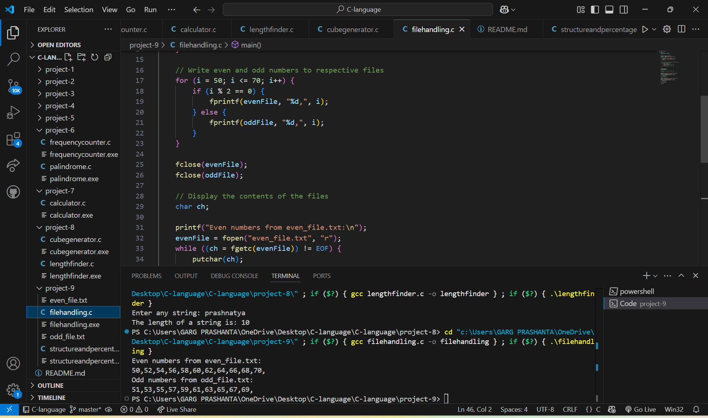

# C Calculator Project

## 🚀 task 1

## 🚀 task 1

## 🚀 task 1

## 🚀 task 1

## 📝 Description

This is a simple calculator program written in C that performs basic arithmetic operations such as addition, subtraction, multiplication, and division. It runs in the terminal and is designed for beginners to understand how functions and user input work in C.

## 🚀 Featur
- Addition of two numbers  
- Subtraction of two numbers  
- Multiplication of two numbers  
- Division of two numbers (with zero-check)

## 📁 Project Structure

